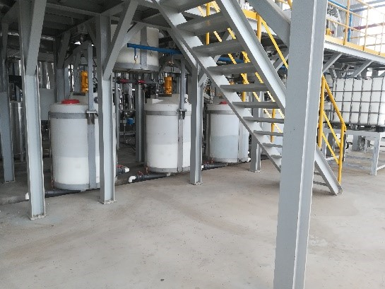
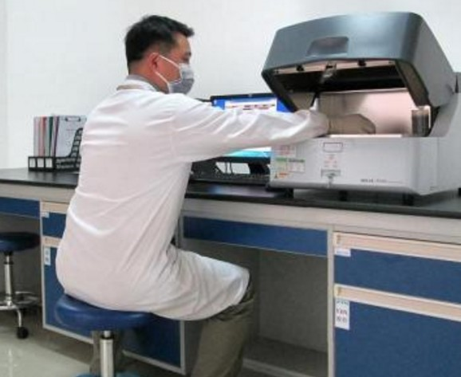
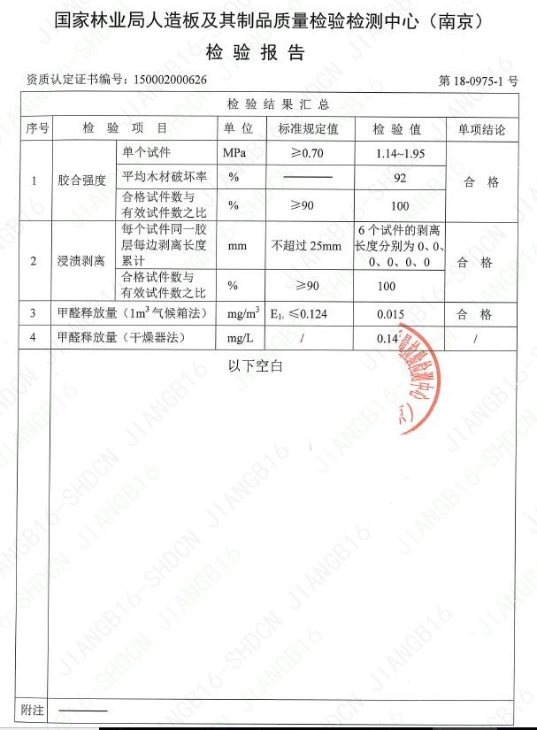

无醛材料追踪
=========
<!-- 胶黏剂认证-->

1.胶黏剂认证
胶黏剂认证的目的是保证板材使用的胶黏剂无醛添加，产品能够应用于板材生产，且未发生变质。

  <table>
    <tr>
      <th align="left">认证项目</th>
      <th align="middle">认证结果</th>
      <th align="middle">认证结论</th>
    </tr>
    <tr>
      <td align="left">胶黏剂主剂</td>
      <td align="middle">聚氨酯</td>
      <td align="middle">成分中不含甲醛</td>
    </tr>
    <tr>
      <td align="left">胶黏剂助剂</td>
      <td align="middle">氢氧化钠，硫化钠</td>
      <td align="middle">成分中不含甲醛</td>
    </tr>
    <tr>
      <td align="left">粘度</td>
      <td align="middle">23000CP</td>
      <td align="middle">适用板材加工工艺</td>
    </tr>
    <tr>
      <td align="left">固含量</td>
      <td align="middle">38%</td>
      <td align="middle">满足板面胶合需求</td>
    </tr>
    <tr>
      <td align="left">固化时间</td>
      <td align="middle">33s</td>
      <td align="middle">符合热压工艺要求</td>
    </tr>
    <tr>
      <td align="left">游离甲醛量</td>
      <td align="middle">未检出</td>
      <td align="middle">成品不含甲醛</td>
    </tr>
    <tr>
      <td align="left">生产时间</td>
      <td align="middle">2018年10月29日</td>
      <td align="middle">近期生产，存储期内使用完毕</td>
    </tr>
    <tr>
      <td align="left">生产批次</td>
      <td align="middle">WH11387</td>
      <td align="middle">万晟专用标签及编号方式</td>
    </tr>

  </table>

  

    
    

  

    黏剂存储罐
  

  

    
  

  

    胶黏剂测试
  

<!-- 基材认证-->

2.基材认证
基材的认证目的是保证生产使用万晟指定胶黏剂，不发生胶黏剂替换，生产工艺与胶黏剂及木材特性相符，最终保证产品物理及甲醛指标达标。

  <table>
    <tr>
      <th align="left">认证项目</th>
      <th align="middle">认证结果</th>
      <th align="middle">认证结论</th>
    </tr>
    <tr>
      <td align="left">胶黏剂批次</td>
      <td align="middle">WH11387</td>
      <td align="middle">为万晟认证胶黏剂批次号</td>
    </tr>
    <tr>
      <td align="left">调胶添加剂</td>
      <td align="middle">豆粉，铁红，胶液</td>
      <td align="middle">生产过程不引入甲醛</td>
    </tr>
    <tr>
      <td align="left">施胶量</td>
      <td align="middle">9%</td>
      <td align="middle">符合板材胶合要求</td>
    </tr>
    <tr>
      <td align="left">热压温度</td>
      <td align="middle">125℃</td>
      <td align="middle">符合胶黏剂固化温度要求</td>
    </tr>
    <tr>
      <td align="left">热压时间</td>
      <td align="middle">35s/cm</td>
      <td align="middle">与胶黏剂固化时间吻合</td>
    </tr>
    <tr>
      <td align="left">热压压力</td>
      <td align="middle">1.4Mpa</td>
      <td align="middle">不压溃破坏木材细胞结构</td>
    </tr>
    <tr>
      <td align="left">胶黏剂用量产出</td>
      <td align="middle">1吨产12 m3</td>
      <td align="middle">近期生产，存储期内使用完毕</td>
    </tr>
    <tr>
      <td align="left">生产批次</td>
      <td align="middle">WH11387</td>
      <td align="middle">未发生胶黏剂替换情况</td>
    </tr>
    <tr>
      <td align="left">独立库房</td>
      <td align="middle">无醛产品独立库房</td>
      <td align="middle">不受含醛产品释放甲醛污染</td>
    </tr>
    <tr>
      <td align="left">基材甲醛</td>
      <td align="middle">0.01mg/m3</td>
      <td align="middle">木质材料本身释放甲醛范围</td>
    </tr>
    <tr>
      <td align="left">生产时间</td>
      <td align="middle">2018年11月17日</td>
      <td align="middle">胶黏剂存有效期内生产</td>
    </tr>
    <tr>
      <td align="left">生产批次</td>
      <td align="middle">WH02338</td>
      <td align="middle">万晟专用标签及编号方式</td>
    </tr>
  </table>

  

    
  

<!-- 表材认证-->

3.表材认证
表材认证的目的是保证使用的饰面材料为无醛材料，产品的质量稳定，可完全取代有醛产品。

<table>
  <tr>
    <th align="left">认证项目</th>
    <th align="middle">认证结果</th>
    <th align="middle">认证结论</th>
  </tr>
  <tr>
    <td align="left">饰面材料主成分</td>
    <td align="middle">聚烯烃</td>
    <td align="middle">无苯无害，不含甲醛</td>
  </tr>
  <tr>
    <td align="left">饰面材料辅成分</td>
    <td align="middle">聚氨酯</td>
    <td align="middle">无苯无害，不含甲醛</td>
  </tr>
  <tr>
    <td align="left">表面耐磨</td>
    <td align="middle">2500r</td>
    <td align="middle">符合日常使用要求</td>
  </tr>
  <tr>
    <td align="left">硬度</td>
    <td align="middle">1H</td>
    <td align="middle">符合日常使用要求</td>
  </tr>
  <tr>
    <td align="left">甲醛释放量</td>
    <td align="middle">未检出</td>
    <td align="middle">不含甲醛</td>
  </tr>
  <tr>
    <td align="left">生产日期</td>
    <td align="middle">2018年11月13日</td>
    <td align="middle">近期生产，万晟定制</td>
  </tr>

  <tr>
    <td align="left">生产批次</td>
    <td align="middle">DZ01363</td>
    <td align="middle">万晟专用标签及编号方式</td>
  </tr>

</table>

<!-- 饰面认证-->

4.饰面认证
饰面生产过程认证的目的是保证生产过程使用万晟指定产品，胶合过程中使用的胶黏剂的无醛，无醛产品使用单独厂房堆放。

<table>
  <tr>
    <th align="left">认证项目</th>
    <th align="middle">认证结果</th>
    <th align="middle">认证结论</th>
  </tr>
  <tr>
    <td align="left">材料批次</td>
    <td align="middle">DZ01363,WH02338</td>
    <td align="middle">万晟认证过的基材，饰面材料批次号</td>
  </tr>
  <tr>
    <td align="left">饰面胶黏剂</td>
    <td align="middle">PUR</td>
    <td align="middle">聚氨酯，不引入甲醛</td>
  </tr>
  <tr>
    <td align="left">表面平整度</td>
    <td align="middle">0.02%</td>
    <td align="middle">平整度合格，符合万晟要求</td>
  </tr>
  <tr>
    <td align="left">表面耐刮擦</td>
    <td align="middle">表面无连续划痕</td>
    <td align="middle">满足国标要求</td>
  </tr>
  <tr>
    <td align="left">独立库房</td>
    <td align="middle">无醛产品单独堆放</td>
    <td align="middle">不存在交叉污染风险</td>
  </tr>
  <tr>
    <td align="left">生产时间</td>
    <td align="middle">2018年11月25日</td>
    <td align="middle">近期生产，万晟定制产品</td>
  </tr>
  <tr>
    <td align="left">生产批次</td>
    <td align="middle">VS10347</td>
    <td align="middle">万晟专用标签及编号方式</td>
  </tr>

</table>

<!-- 加工认证-->

5.加工认证
加工现场的认证目的是保证生产过程中使用的胶黏剂为无醛胶黏剂，生产中使用的材料为万晟指定的无醛产品。

<table>
  <tr>
    <th align="left">认证项目</th>
    <th align="middle">认证结果</th>
    <th align="middle">认证结论</th>
  </tr>
  <tr>
    <td align="left">板材批次</td>
    <td align="middle">VS10347</td>
    <td align="middle">万晟认证过的板材批次号</td>
  </tr>
  <tr>
    <td align="left">封边用胶黏剂</td>
    <td align="middle">EVA</td>
    <td align="middle">无醛产品</td>
  </tr>
  <tr>
    <td align="left">封边材料</td>
    <td align="middle">弹性木皮</td>
    <td align="middle">天然木材</td>
  </tr>
  <tr>
    <td align="left">甲醛释放量</td>
    <td align="middle">0.01mg/m3</td>
    <td align="middle">木材甲醛释放量范围</td>
  </tr>

  <tr>
    <td align="left">生产时间</td>
    <td align="middle">2018年11月23日</td>
    <td align="middle">近期生产，万晟定制产品</td>
  </tr>
  <tr>
    <td align="left">生产批次</td>
    <td align="middle">SDM11386</td>
    <td align="middle">万晟专用标签及编号方式</td>
  </tr>

</table>

<!-- 成品检测-->

6.成品检测
最终成品的检测，由专业的国家监管部门认可的检测机构的测试，产品测试结果符合无醛添加标准。

<table>
  <tr>
    <th align="left">认证项目</th>
    <th align="middle">认证结果</th>
    <th align="middle">认证结论</th>
  </tr>
  <tr>
    <td align="left">送检部门</td>
    <td align="middle">国家林业局人造板检测中心</td>
    <td align="middle">具备CMA资质专业第三方检测机构</td>
  </tr>
  <tr>
    <td align="left">送检批次</td>
    <td align="middle">DM11386</td>
    <td align="middle">万晟认证过的板材批次号</td>
  </tr>
  <tr>
    <td align="left">送检日期</td>
    <td align="middle">2018年12月2日</td>
    <td align="middle">生产完送检，未经通风晾晒</td>
  </tr>
  <tr>
    <td align="left">甲醛释放量</td>
    <td align="middle">0.015mg/m3</td>
    <td align="middle">木质材料本身释放甲醛范围</td>
  </tr>

  <tr>
    <td align="left">内结合强度</td>
    <td align="middle">0.56-0.81Mpa</td>
    <td align="middle">板材胶合强度符合国标</td>
  </tr>
  <tr>
    <td align="left">浸渍剥离</td>
    <td align="middle">合格</td>
    <td align="middle">耐水性符合国标</td>
  </tr>
  <tr>
    <td align="left">吸水膨胀率</td>
    <td align="middle">0.1%</td>
    <td align="middle">吸收厚度膨胀率符合国标</td>
  </tr>
</table>

<!-- 组装装配-->

7.组装装配
万晟制定了严格的现场巡检制度，保证进入到现场的产品均为万晟认证过的无醛产品，从而保证产品最终的无醛添加。

<table>
  <tr>
    <th align="left">认证项目</th>
    <th align="middle">认证结果</th>
    <th align="middle">认证结论</th>
  </tr>
  <tr>
    <td align="left">安装产品批号</td>
    <td align="middle">SDM11587</td>
    <td align="middle">万晟专供产品，未发生产品替换</td>
  </tr>
  <tr>
    <td align="left">现场使用胶黏剂</td>
    <td align="middle">均为万晟指定产品</td>
    <td align="middle">无违规含醛产品带入</td>
  </tr>
  <tr>
    <td align="left">现场空气甲醛量</td>
    <td align="middle">0.018</td>
    <td align="middle">处于婴儿呼吸安全阈</td>
  </tr>
  <tr>
    <td align="left">现场TVOC</td>
    <td align="middle">0.177</td>
    <td align="middle">远低于国标</td>
  </tr>
</table>

  

